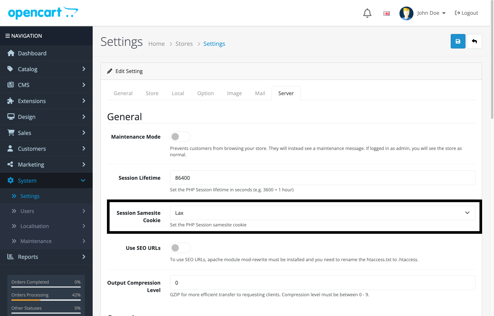

# CHIP for OpenCart 4.x

This module adds CHIP payment method option to your OpenCart 4.x.

## Compatibility

Payments work on OpenCart **4.0.0.0 and later**.

### Which repository to use

This repository serves **OpenCart 4.1.0.x only**. Use the `4.0` build in
[`chip-for-opencart`](https://github.com/CHIPAsia/chip-for-opencart) for OpenCart
**4.0.x**, including 4.0.2.x.

Both builds implement both payment entry points (`getMethod()` for 4.0.0.0 – 4.0.1.1,
`getMethods()` for 4.0.2.0 and later), so either one takes payments on either
version. They differ in how renewals are triggered, and that difference decides
which build an OpenCart 4.0.x store must install.

| OpenCart version | Build to install | Payments | Subscription renewals |
| --- | --- | --- | --- |
| **4.1.0.x** | this repository | ✅ | ✅ via OpenCart's `cron.php` |
| **4.0.2.x** | `chip-for-opencart` (`4.0`) | ✅ live-tested | ✅ via the build's own endpoint |
| **4.0.0.0 – 4.0.1.1** | `chip-for-opencart` (`4.0`) | ✅ live-tested | ✅ via the build's own endpoint |

**OpenCart 4.1.0.x** is scheduled by OpenCart itself: `cron/subscription.php` creates
the renewal order and then calls the payment extension back
(`$store->load->controller('extension/<extension>/cron/<code>')`). Point your
server's cron at OpenCart's own `cron.php` and nothing else is needed.

**OpenCart 4.0.x is different, and this is why it needs the other build.** No 4.0.x
release lets OpenCart's scheduler drive a renewal:

* **4.0.0.0 – 4.0.1.1** ship no `cron/subscription.php` at all.
* **4.0.2.0 – 4.0.2.3** ship one, but the call into the payment extension is
  commented out (`cron/subscription.php`, line 319 in 4.0.2.0 / 383 in 4.0.2.3), so
  core creates the renewal order and never asks the gateway to charge it.

The `4.0` build in `chip-for-opencart` therefore carries its own cron endpoint, which
runs whether or not core's scheduler cooperates:

```
* * * * * curl -s "https://your-store.example/index.php?route=extension/chip/cron/chip&token=<cron_token>" >/dev/null
```

`<cron_token>` is generated for you and shown on the gateway settings page when you
open it. This build does **not** carry that endpoint, and its settings page points at
`route=cron/cron` instead — which creates a renewal order on 4.0.x but never charges
it. **Installing this build on OpenCart 4.0.x still takes payments, but a
subscription there will never renew.**

OpenCart **4.0.0.0 – 4.0.1.1** resolve the payment method through `getMethod()` and
**4.0.2.0 and later** through `getMethods()`; both builds implement both, so checkout
succeeds across the range on either.

## Installation

**OpenCart 4.1.0.x** — use this build:

* [Download zip file of OpenCart plugin](https://github.com/CHIPAsia/chip-for-opencart-4.1/releases/latest/download/chip.ocmod.zip)
* Upload to the Extension Installer and Install
* Navigate to : **Extensions** -> **Payments**
* Click **Install**, for CHIP Payment Gateway.

**OpenCart 4.0.x — do not use this build.** Use the `4.0` build in
[`chip-for-opencart`](https://github.com/CHIPAsia/chip-for-opencart) instead; it
carries the cron endpoint that 4.0.x needs for renewals.

Keep the file named `chip.ocmod.zip`. OpenCart 4.x derives the extension code from
the filename, and this module's routes are resolved under `extension/chip/...` —
renaming the zip installs the files where no route can reach them.

## Configuration

Set the **Brand ID** and **Secret Key** in the plugins settings.

### Recurring payments

Renewals run from OpenCart's built-in cron, which must be configured on the store's
server:

```
php /path/to/opencart/cron.php
```

This applies to **OpenCart 4.1.0.x**. On OpenCart 4.0.x, install the `4.0` build from
[`chip-for-opencart`](https://github.com/CHIPAsia/chip-for-opencart) and use its own
cron endpoint instead — see [Which repository to use](#which-repository-to-use).

A failed renewal is retried after 1, 3 and 5 days, measured from the original due
date. After the fourth failed attempt the subscription is **suspended**; the stored
card is retained, so a later payment reactivates the subscription with a fresh
schedule. A card the gateway rejects as no longer valid suspends the subscription
immediately rather than retrying it.

### Important Requirement

**Session SameSite Cookie Setting**: For the CHIP payment integration to work properly, merchants need to set the session samesite cookie to **Lax** instead of **Strict**. 

To configure this setting:
1. Navigate to **OpenCart Admin >> System >> Settings >> Stores >> Server**
2. Set the **Session SameSite Cookie** to **Lax**



This setting is required for the payment gateway redirects and callbacks to function correctly.

## What has been tested live

Against a real OpenCart store, installed through the Extension Installer:

* **OpenCart 4.1.0.4** — subscription/renewal lifecycle, dunning ladder, recovery from
  a suspended subscription, and the renewal cron: 36/36 checks pass. The callback and
  cron guards were added to this list for 1.4.0: with the public key configured, a
  forged callback was **HTTP 200 before the fix and 401 after**, and a correctly signed
  callback still returns 200; the cron self-guard answers 403 both ways.
* **OpenCart 4.0.2.3**, with the `4.0` build — the same lifecycle plus the cron token
  endpoint: 52/52 checks pass.

The dunning ladder is also exercised with a negative control: with the
per-subscription lock removed, two overlapping cron runs charge the customer twice;
with it in place, once.

**OpenCart 4.0.0.0 and 4.0.1.1 have since been exercised on real stores** with the `4.0`
build: payments, the paid callback (a corrupted signature and a tampered payload are both
rejected), the renewal token endpoint refusing an anonymous and a wrong-token request
without charging, dunning, recovery, and the cron self-guard. Each needed a patch on the
test store for defects in core's own subscription insert path - core's code, not this
module's.

## Other

See [CHANGELOG.md](CHANGELOG.md) for release history.

Facebook: [Merchants & DEV Community](https://www.facebook.com/groups/3210496372558088)
